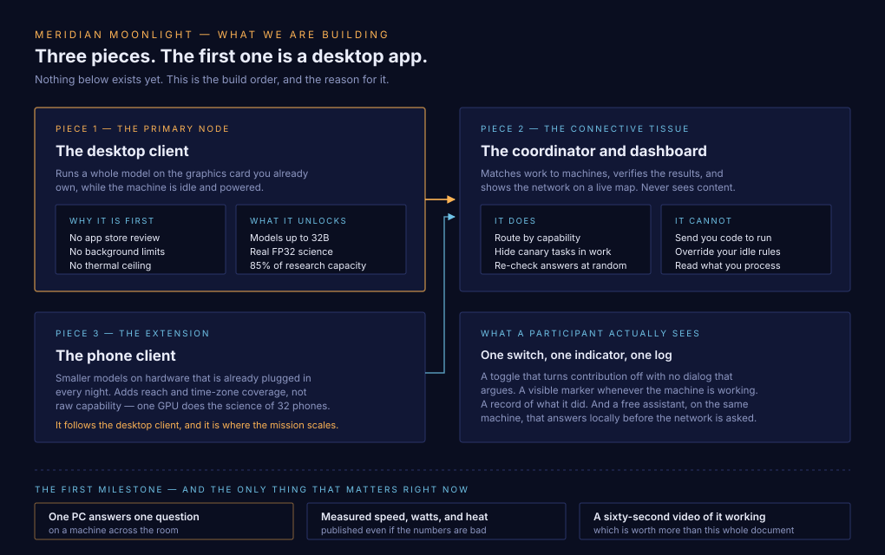
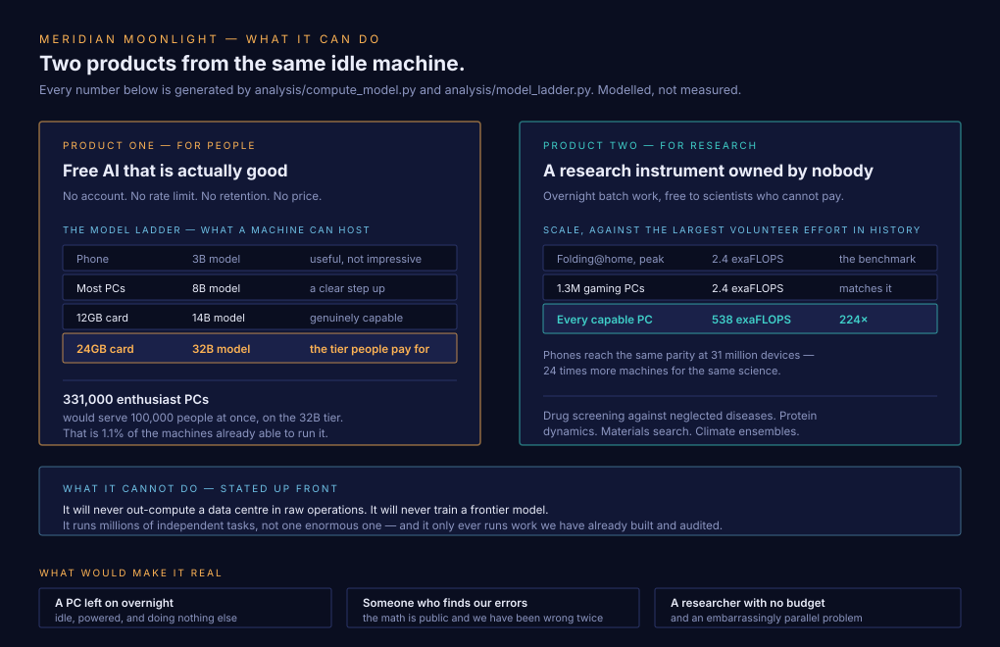
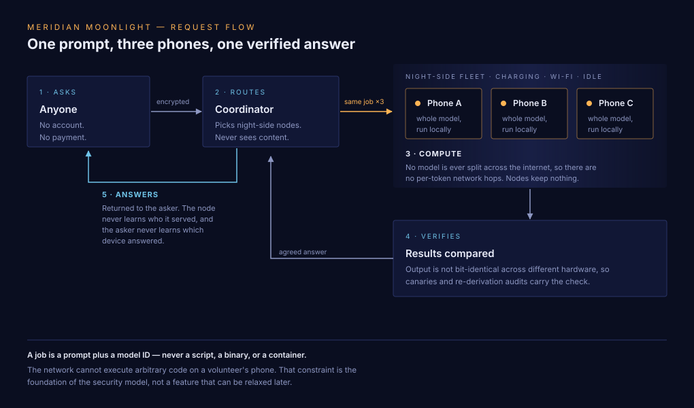
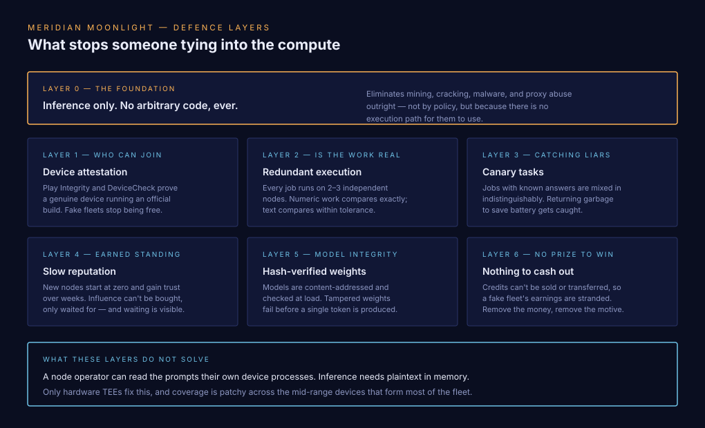
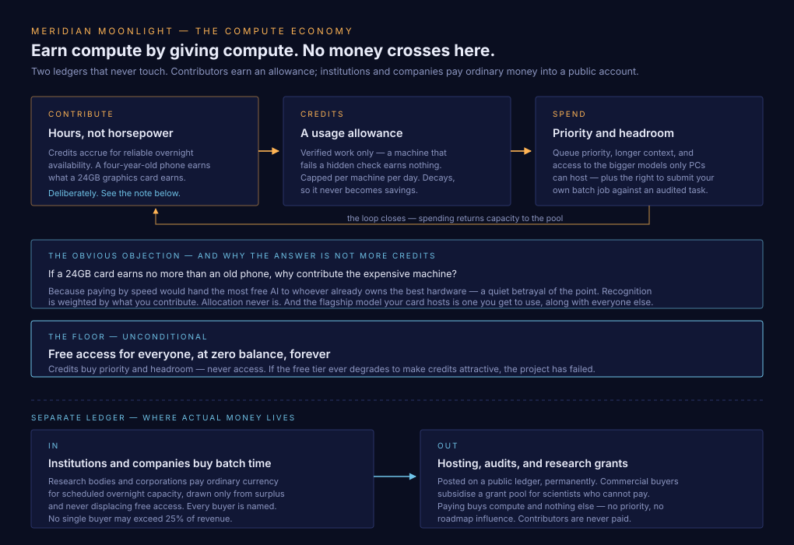

<h1 align="center">Meridian Moonlight</h1>

<p align="center">
  <strong>A free AI network built from the graphics cards people already own.</strong><br>
  The most powerful computer in your house does nothing all night.<br>
  No data center. No token. No cost to you.
</p>

<p align="center">
  <a href="https://meridianmoonlight.com"><strong>meridianmoonlight.com</strong></a> ·
  <a href="WHITEPAPER.md">Whitepaper</a> ·
  <a href="analysis/NUMBERS.md">Check the math</a> ·
  <a href="docs/faq.md">FAQ</a>
</p>

<p align="center">
  
  
  
</p>

---

## Status: this is a proposal. No code has been written yet.

What exists is a design, an auditable compute model, and a whitepaper. What does not exist is an app, a coordinator, or a network. Milestone 0 is one PC answering one question — and it hasn't happened.

We publish at this stage on purpose. The numbers most likely to be wrong are cheaper to correct now than after a year of building on them.

---

## What we're building



## What it can do



---

## The idea



1. **Each machine runs a whole model.** Up to 32B on a 24GB graphics card. Nothing is split across the internet — splitting a model means a network round trip per layer per token, which is five to six orders of magnitude too slow. [Why](WHITEPAPER.md#21-this-is-not-one-giant-brain).
2. **Contribution is gated to conditions you'd never notice.** Charging, on Wi-Fi, screen off, battery above 80%, device cool. One switch turns it off, with no dialog that argues.
3. **Compute follows the moon.** Night circles the planet continuously, so supply migrates westward around the clock and never drops below ~14% of the enrolled fleet.
4. **Requests are answered locally first.** The network is the fallback, not the default.

---

## PCs do the work. Phones extend the reach.


| | **PCs and Macs** *(primary)* | Phones *(extension)* |
|---|---|---|
| **Carries** | The capability and the science | Reach, time-zone coverage, the mission at scale |
| **Biggest model** | **32B on a 24GB card** — the tier people pay for | 3B — useful, not impressive |
| **Strength** | Real GPUs, mains power, no app store, no thermal ceiling | 1.2B devices, plugged in nightly |
| **Weakness** | People switch them off (19.6% vs 25.7% availability) | Bandwidth-starved and thermally limited |
| **Folding@home parity** | **~1.3M gaming PCs** | ~31M devices — 24× more machines |

A discrete GPU does the scientific work of about **32 phones**, and it is the only hardware that can host a model big enough to compete with what people currently pay for. There are only 920M desktops against 4.6B handsets, and they are switched off more often — and they still supply **85% of the network's scientific capacity.**

**So the desktop client is what gets built first**, and it is what the numbers here are about. The phone client follows, and it is where the mission scales: a billion devices already plugged in every night, reaching people who do not own a PC at all.

**PCs also raise the ceiling on the AI itself.** A 32B-class model needs 22GB, which only ~30M desktops can run fast enough to hold a conversation — but that means **~331,000 enthusiast machines would serve 100,000 concurrent conversations** against a model in the tier people currently pay for. Everywhere else here capability needs scale; this needs a small number of the right machines. The costs — harder verification, contention with the science tier, and concentration on ~6% of nodes — are in [analysis/LADDER.md](analysis/LADDER.md).

---

## It serves the people in it, from the first thousand machines

**The network doesn't need to beat a data center. It needs to serve the people in it — and it does that from the first thousand devices.**

Capacity and membership grow together, so each participant's share is about **274,000 output tokens per day** — roughly **9× heavy personal use**, and 5× even at the daily supply trough. That ratio is identical at a thousand devices and at a billion. There is no critical mass to reach, and no chicken-and-egg problem that needs a token to solve.


The ~89% surplus is the research instrument.

## Security: the network never runs arbitrary code



**A job is a prompt plus a task-type ID — never a script, a binary, or a container.** On every tier, phones and desktops alike.

That eliminates crypto mining, password cracking, malware, and proxy abuse *structurally* rather than by policy. Competitors run general-purpose runtimes; that flexibility is the attack surface.

The cost is real and we state it: **the network can only ever compute things we have already implemented.** Scientific work runs as [a fixed catalogue of audited task types](docs/task-types.md), so a researcher cannot bring a novel simulation — they request a task type and wait for a release.

Full detail, including [what these defences don't solve](docs/threat-model.md#6-what-this-design-cannot-do), in the [threat model](docs/threat-model.md) and [desktop security](docs/desktop-security.md).

---

## The compute economy



Contributors earn **compute credits** — a usage allowance, not a currency. They can't be bought, sold, transferred, or cashed out; they decay on a 90-day half-life; they're never votes. They're earned by **hours of reliable availability, not throughput**, so a four-year-old phone earns the same as a flagship.

**The free tier stays free for everyone regardless of balance.** Credits buy priority and headroom, never access. *If the free tier ever degrades to make credits attractive, the project has failed.*

Real money lives on a **separate ledger**: institutions and companies buy overnight batch capacity, from surplus only, on a public ledger, with a published buyer register and a 25% concentration cap. Contributors are never paid — which is what keeps them volunteers rather than unlicensed contractors.

Why not split the money among contributors? [We costed it](analysis/ECONOMICS.md): a phone earns **$1.32/year** and burns **$1.58** of its owner's electricity to do it. In most of the world participants would pay to contribute. Details and the [six non-financial reasons](docs/economy.md#why-the-money-is-not-divided-among-contributors).

---

## Why any of this is trustworthy

Every number in this repo and on the website is generated by one auditable script. Nothing is hand-typed downstream.

```bash
pip install numpy matplotlib
python analysis/compute_model.py
```

That writes [`analysis/NUMBERS.md`](analysis/NUMBERS.md), [`analysis/numbers.json`](analysis/numbers.json), and every figure in `docs/figures/`. Assumptions are named constants with their basis and confidence stated inline. Re-running produces byte-identical output.

**Finding an error is the single most useful contribution you can make.** [Open an issue](../../issues/new) — including against the four inputs we've flagged as our own weakest:

| Constant | Value | Why we're unsure |
|---|---|---|
| `THERMAL_DERATE` | 0.70 | Sustained vs burst over 8 hours. Barely studied. |
| `fp32_sustained_fraction` | 0.30–0.80 | Mobile GPU sustained FP32 is almost undocumented |
| `SHARE_RAM_8GB_PLUS` | 0.26 | Installed-base RAM distribution is hard to source |
| Device-density longitude weights | 21 clusters | **Our own construction. No dataset backs them.** |

The [sensitivity analysis](WHITEPAPER.md#7-sensitivity-what-if-we-are-wrong) shows the full range across every assumption is 16M–63M devices for Folding@home parity. A 4× band, published up front.

### We've been wrong twice, and both are on the record

An earlier draft claimed 1.4% adoption would surpass the largest AI data center — wrong by ~400×, because LLM inference is bound by memory bandwidth rather than processing power. A later draft claimed inference is deterministic so honest machines agree exactly — true only on identical hardware, and it would have accused honest volunteers of cheating.

Both are retracted in full, with the arithmetic, in [Appendix B](WHITEPAPER.md#appendix-b-what-we-retract). That table is the reason to trust the rest.

---

## Honest limits

Three are physics and will not be engineered away.

| | |
|---|---|
| **Not one giant brain** | Splitting a model across internet-connected machines costs a round trip per layer per token. Each node runs a whole model. |
| **Will not train frontier models** | Training needs terabytes/second between processors inches apart. Federated *fine-tuning* is in scope; pre-training never will be. |
| **Throughput, not a pooled engine** | A million independent tasks, not one task a million times faster. |
| **Data centers batch; we can't** | They read each weight once for hundreds of users. We read it once per token for one. Our advantage is that the hardware is already bought and marginal cost is zero. |
| **Node operators can read what they process** | Inference needs plaintext in memory. Only TEEs fix it, and coverage is patchy. Mitigated structurally — no requester identity, no session continuity — not solved. |
| **Sybil resistance is bounded, not solved** | Nobody has solved it without a trusted registry or a costly stake. We removed the payoff instead. |

---

## Open questions we haven't settled

1. **Funding.** Nobody has agreed to pay for anything. M0–M2 must run essentially unfunded.
2. **Battery health over years.** No longitudinal data exists and won't for a year. Currently an assumption.
3. **iOS.** Background limits effectively forbid this; an iOS node can only contribute app-open and charging.
4. **Ride Acurast's protocol, or build the stack?** Acurast has 250k+ nodes and a working TEE-based network. Owning the consumer layer and mission on top of someone else's compute layer is a live option.
5. **Semantic agreement thresholds.** What similarity score counts as "agreement" for text is unsolved and must end up published and independently computable.

---

## Roadmap


| | Milestone | Scale | The deliverable that matters |
|---|---|---|---|
| **M0** | One node lives | 1 PC, then 1 phone | **Measured** tok/s, watts, thermals — and where bit-exactness actually holds |
| **M1** | The network answers | ~100 | Routing, redundant verification, reputation, live node map |
| **M2** | Follow the moon | ~10K | **Measured** 24-hour availability curve; first real science batch job |
| **M3** | Open protocol | ~100K | Spec v1.0, third-party nodes, governance in force, first research partner |
| **M4** | Public utility | 1M+ | Full P2P discovery; a network nobody can switch off |

[Issue-ready breakdown](docs/MILESTONES.md). If M0's measurements contradict the model, the model changes and the whitepaper gets revised — the same thing that produced this version.

**The one that matters most:** record the 60-second M0 demo. In a space full of whitepapers, a video of something running is what turns a skeptic into a contributor.

---

## Repository map

```
WHITEPAPER.md              The full proposal, with derivations and retractions
VISION.md                  The short version
ARCHITECTURE.md            Technical design and the reasoning
analysis/
  compute_model.py         Single source of numeric truth. Run it.
  participant_economics.py Why contributors aren't paid in cash
  model_ladder.py          What bigger models on desktops would change
  NUMBERS.md · ECONOMICS.md   Generated
docs/
  task-types.md            The audited catalogue Layer 0 forces, and its cost
  threat-model.md          Layer 0, verification, and what it doesn't solve
  desktop-security.md      Trusting nodes you cannot attest
  economy.md               Credits, buyer tiers, public ledger
  protocol-spec.md         Node protocol (grows into the open standard)
  governance.md            How decisions get made, and how to fork us
  faq.md · MILESTONES.md
  diagrams/ · figures/     Diagrams by hand; figures generated
site/                      meridianmoonlight.com (static, no build step)
deploy/                    Exactly what to upload to cPanel
PROJECT_LOG.md             Session history and decisions
```

---

## Contributing

In rough order of usefulness:

- **Find an error in the math.** [`analysis/compute_model.py`](analysis/compute_model.py). Genuinely the most valuable thing right now.
- **Benchmark a machine.** M0 needs measured tok/s, watts, and thermals across many machines — especially graphics cards. A table one person cannot build.
- **Desktop client work.** llama.cpp plus a contribution gate, no app store in the way. This is the critical path — see [MILESTONES](docs/MILESTONES.md).
- **Attack the threat model.** [Sybil resistance is bounded, not solved](docs/threat-model.md#sybil-resistance), and the [content-routing design](docs/threat-model.md#1-protecting-volunteers) deserves argument.
- **Bring a workload** if you're a researcher with a parallel problem and no budget.

See [CONTRIBUTING.md](CONTRIBUTING.md) and [CODE_OF_CONDUCT.md](CODE_OF_CONDUCT.md).

---

## Licence

Code [Apache-2.0](LICENSE). Documentation and figures [CC BY 4.0](https://creativecommons.org/licenses/by/4.0/). Permissive on purpose — [the right to fork this](docs/governance.md) should be real.

---

<p align="center"><em>Owned by no one. Available to everyone. Growing with every person who joins.</em></p>

<p align="center">
  <sub>No figure in this project uses red as a signal colour — roughly 8% of men, including this project's author, can't reliably distinguish it from green.</sub>
</p>
