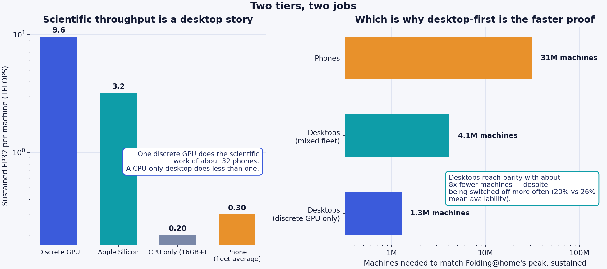
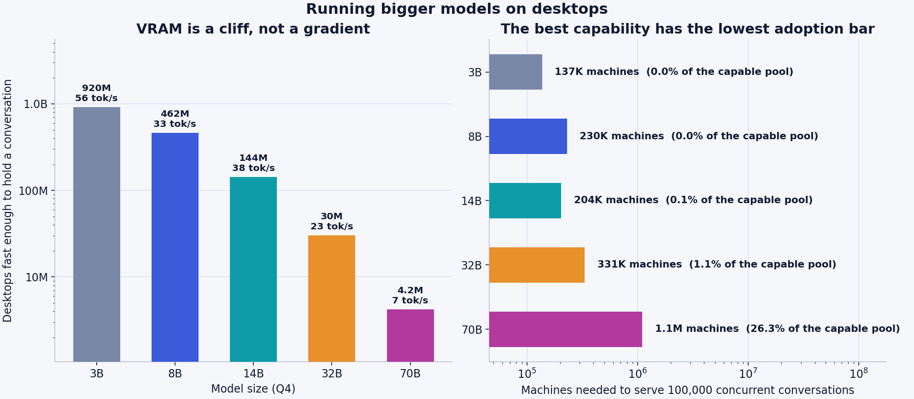
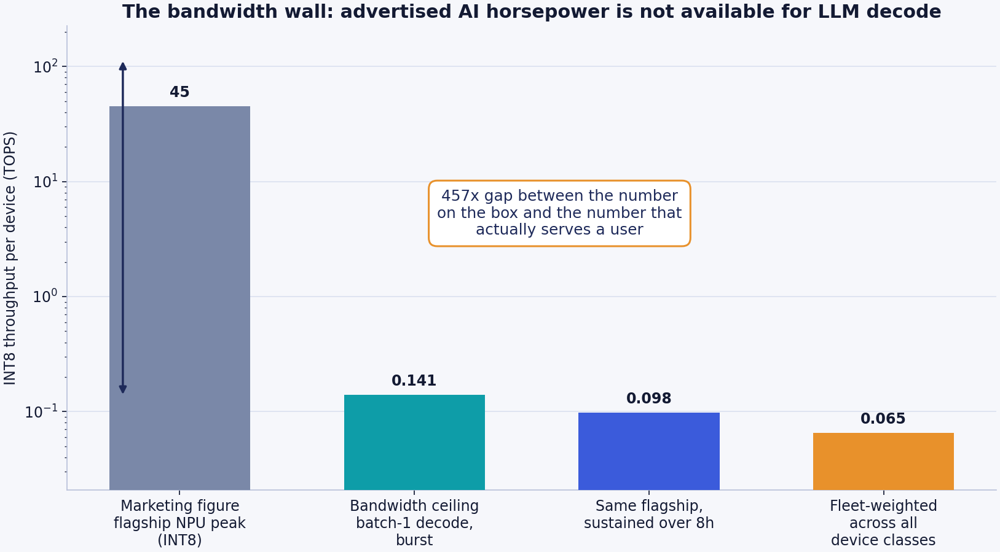
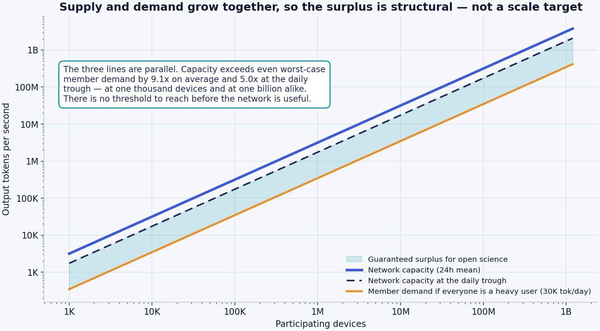
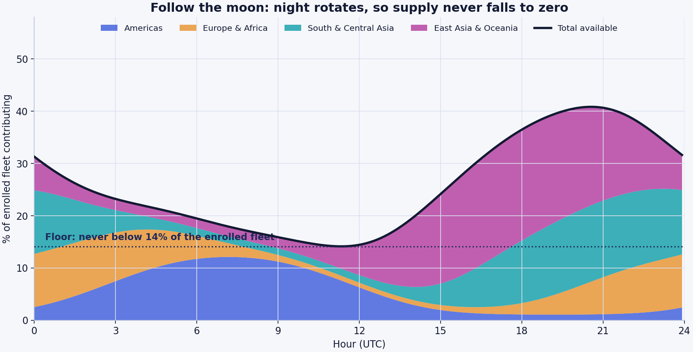
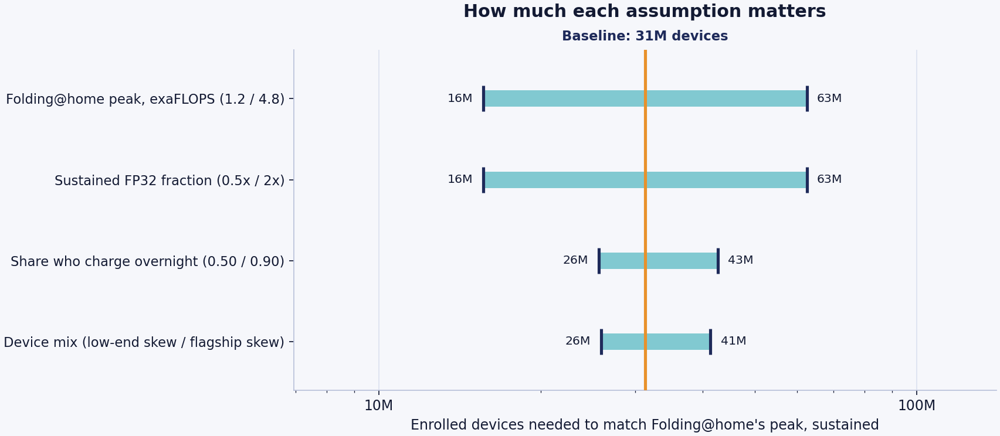
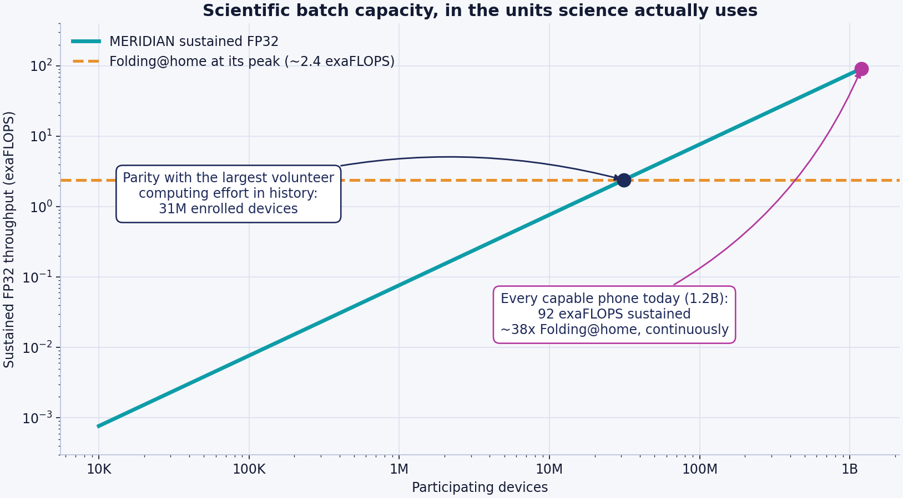
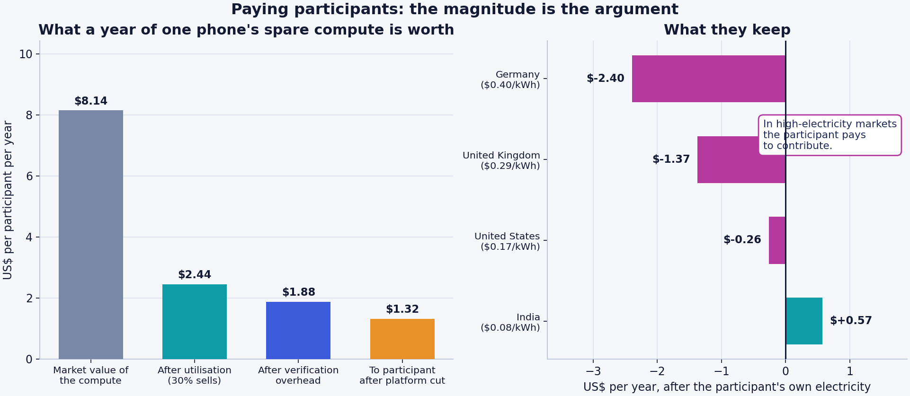
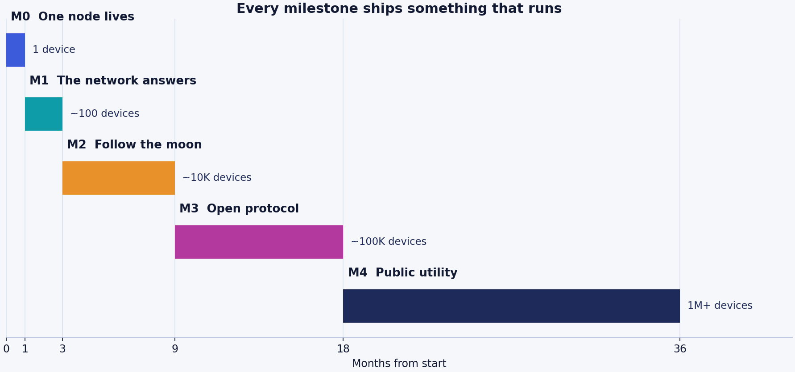

# Meridian Moonlight

## A free AI network built from the graphics cards people already own

**Version 0.2 — July 2026**
**Status: proposal. Nothing in this document has been built yet.**

---

## Abstract

Capable AI runs almost entirely inside data centres owned by a handful of companies. Meanwhile roughly 920 million desktop computers — 250 million of them with a discrete graphics card — sit idle every night, alongside 1.2 billion smartphones with enough memory to host a small language model.

Meridian Moonlight proposes to use them, **desktops first.** Each participating machine runs a *complete* model locally — never a fragment — and contributes spare capacity only while powered, idle, and on an unmetered connection. Because night circles the planet continuously, the supply migrates westward around the clock and never falls to zero.

**The desktop tier is the primary path and the phone tier extends it**, which is the reverse of how this project was originally framed. The reason is in the numbers: one discrete GPU does the scientific work of about 32 phones, only a desktop can host a model large enough to matter, and the desktop client faces no app-store review, no background-execution limit, and no thermal ceiling. Phones remain the mission — a billion devices already plugged in nightly, reaching people who own no PC — but they extend reach rather than supply capability.

**The network never executes arbitrary code on a volunteer's machine.** A job is a prompt plus a task-type ID drawn from an audited, published catalogue — never a script, a binary, or a container. That single constraint eliminates mining, cracking, malware, and proxy abuse structurally rather than by policy, on every tier. Its cost — the network can only compute things already implemented in the client — is stated in [§3.5](#35-layer-0-and-the-task-type-catalogue).

This document is unusual in one respect: **two of its central claims are downward revisions of earlier drafts of this same project.**

The first draft asserted that ~30 million devices (1.4% of the capable fleet) would surpass the largest AI data centre on Earth. That was built on peak NPU throughput figures and does not survive a bandwidth-bound analysis. The honest figure is roughly 12 billion devices — more smartphones than exist. **The network will not out-compute a hyperscale data centre in raw operations, and no amount of adoption changes that.**

The second asserted that inference at temperature 0 is deterministic, so honest nodes agree exactly and any result can be re-derived and checked. **That is true on identical hardware and false across a heterogeneous fleet**, and it was load-bearing in three security documents. Verification is rebuilt on canary tasks and coordinator re-derivation in [§3.3](#33-verification).

What survives is stronger, because none of it depends on winning a compute race:

1. **The network is self-sufficient at every scale.** Capacity and membership grow together, so each participant's share is roughly 274,000 output tokens per day — about **9× heavy personal use**, and 5× even at the daily supply trough. Identical at one thousand devices and at one billion. There is no threshold to cross before the network is useful to the people in it.
2. **The surplus is a research instrument, and it lives on the desktop tier.** A discrete GPU does the scientific work of about **32 phones**. Folding@home parity needs ~31 million phones — or **~1.3 million gaming PCs.** At full enrolment both fleets together deliver about **630 exaFLOPS sustained, ~262× Folding@home's peak**, with 85% of it coming from desktops.
3. **Its structural advantages are ones data centres cannot copy** — marginal cost near zero, hardware already paid for, no single point of control, and privacy-preserving federated analysis over data that legally cannot be centralised.
4. **Contributors are reciprocated in capability, not currency.** Non-transferable, decaying compute credits earned by *hours of availability rather than horsepower*, so an old mid-range phone earns like a flagship. Real money sits on a separate public ledger where institutions and companies buy surplus batch capacity. Contributors are never paid, which keeps them volunteers rather than unlicensed contractors.

Every number above is produced by [`analysis/compute_model.py`](analysis/compute_model.py), a few hundred lines of commented Python that anyone can run, audit, and disagree with. The assumptions are named constants. The sensitivity of every conclusion to every assumption is published in [§7](#7-sensitivity-what-if-we-are-wrong). We would rather be corrected than believed.

---

## Contents

- [1. The problem](#1-the-problem)
- [2. What physics forbids](#2-what-physics-forbids)
- [3. Architecture](#3-architecture)
- [4. The fleet](#4-the-fleet)
  - [4.1 The desktop tier](#41-the-desktop-tier)
  - [4.2 The model ladder](#42-the-model-ladder--bigger-models-not-just-science)
- [5. The bandwidth wall](#5-the-bandwidth-wall)
- [6. Follow the moon](#6-follow-the-moon)
- [7. Sensitivity: what if we are wrong](#7-sensitivity-what-if-we-are-wrong)
- [8. What the network is for](#8-what-the-network-is-for)
- [9. Threat model](#9-threat-model)
- [10. Economics: who pays](#10-economics-who-pays)
  - [10.4 Credits, not currency](#104-the-contributor-ledger-credits-not-currency)
  - [10.5 Corporate and institutional buyers](#105-corporate-and-institutional-buyers)
  - [10.6 Why the money is not divided](#106-why-the-money-is-not-divided-among-contributors)
- [11. Governance](#11-governance)
- [12. Prior art and positioning](#12-prior-art-and-positioning)
- [13. Roadmap](#13-roadmap)
- [14. How to falsify this](#14-how-to-falsify-this)
- [Appendix A: derivations](#appendix-a-derivations)
- [Appendix B: what we retract](#appendix-b-what-we-retract)

---

## 1. The problem

Three problems compound as AI becomes more consequential.

**Access is gated.** Capable AI costs money, requires a reliable connection to a distant server, and can be priced out, rate-limited, geo-blocked, or switched off. The people least able to pay are the people for whom a competent tutor, translator, or medical-information assistant would matter most.

**Capability follows capital.** Whoever owns the compute owns the capability. Individuals and communities are consumers of intelligence and never owners of it. Independent researchers and universities increasingly cannot afford to run the experiments they can design.

**The infrastructure is concentrated.** Data centres are enormous, expensive, energy-hungry, and few. That makes them efficient, and it also makes them chokepoints — commercially, politically, and during disasters.

There is an asymmetry worth sitting with. The most widely distributed computing hardware ever manufactured is already in people's pockets, already paid for, already plugged in every night. Its idle capacity is currently worth exactly nothing to anyone.

### 1.1 An honest tension in the mission

The framing "free AI for the three billion people excluded from paid AI" contains a problem we should name rather than paper over: **the people most excluded from paid AI largely do not own the phones that can run these models.** An 8GB-RAM handset is not a poverty device.

So the mission has to be stated in two parts:

- **Contributors** are disproportionately in wealthier markets, because that is where capable hardware is.
- **Beneficiaries** need not be. A network node serves whoever asks, and a 2GB phone that cannot host a model can still hold a conversation with one.

That asymmetry is not a flaw. It is the entire point: it is a transfer of capability from people who have spare silicon to people who do not. But describing it as "giving three billion people a phone that runs AI" would be false, and we do not say it.

---

## 2. What physics forbids

Credibility in this space is established by what you rule out. Three limits are not engineering challenges to be overcome — they are properties of the problem.

### 2.1 This is not one giant brain

Splitting a single large model across phones connected by the internet does not work, and the reason is worth being precise about.

Generating one token requires activations to pass sequentially through every layer of the model. If layers live on different devices, each token costs a network round trip per layer boundary. Inside a data centre, chip-to-chip interconnects deliver hundreds of gigabytes per second at sub-microsecond latency. Between two phones on consumer internet, you have tens of milliseconds and single-digit megabytes per second. That is a gap of five to six orders of magnitude, in the one dimension the workload is most sensitive to.

A 28-layer model split across 28 phones with 40 ms hops spends over a second of pure network latency per token. This is not a matter of better software.

**Meridian does not fight this. Every node runs a complete model.** The network layer routes, verifies, and aggregates; it never carries activations mid-forward-pass.

### 2.2 This will not train frontier models

Training synchronises gradients across the entire parameter set every step. That requires memory bandwidth between processors measured in terabytes per second, which requires the processors to be physically adjacent. Wide-area networks are not a substitute, and no protocol design changes this.

Federated *fine-tuning* of an already-trained small model is a different and genuinely tractable problem, because updates are sparse, compressible, and tolerant of staleness. That is in scope. Pre-training is not.

### 2.3 The compute is throughput, not a pooled engine

A million phones can run a million independent tasks. They cannot make one task a million times faster.

The right mental image is a million couriers, not one cargo jet. Couriers are superb at delivering a million parcels to a million addresses and useless for moving a single shipping container. Every workload described in [§8](#8-what-the-network-is-for) decomposes into independent pieces. Workloads that do not decompose are out of scope, permanently.

### 2.4 And one limit that is not physics, but is real

**Data centres batch. Phones cannot.**

This is the single most important asymmetry in the document, and it is why [§5](#5-the-bandwidth-wall) reaches the conclusion it does. When a data centre serves a language model, it processes hundreds of user requests concurrently against one copy of the weights. Each weight is read from memory once and used hundreds of times. The expensive resource — memory bandwidth — is amortised across every concurrent user.

A phone serving one user has a batch size of one. Every weight is read from memory, used once, and discarded. The phone pays the full bandwidth cost per token that the data centre spreads across hundreds of tokens.

Per unit of hardware, a data centre is therefore *dramatically* more efficient at inference than a phone — by roughly the batch factor. Any honest proposal in this space has to concede that up front. Meridian's advantages lie elsewhere: the hardware is already bought, the electricity is already being spent, and the marginal cost of the next token is zero.

---

## 3. Architecture

### 3.1 Local-first, network-second

The default path for a user's request is the user's own device. No network, no coordinator, no third party, no latency beyond the phone in their hand.

The network exists for three cases:

1. The requesting device cannot host a model at all (under 6GB RAM).
2. The requesting device is busy, hot, or on battery.
3. The request is a batch job rather than a conversation.

This ordering is not an optimisation. It is the privacy architecture, the cost architecture, and — as [§9.2](#92-the-hard-problem-whose-content-runs-on-whose-phone) argues — most of the safety architecture. Every request served locally is a request that generates no bandwidth bill, no log, and no liability.

### 3.2 The contribution gate

A device contributes only when **all** of the following hold:

| Condition | Why |
|---|---|
| Plugged into power | Battery life is the thing users notice first and forgive last |
| On Wi-Fi | Never spend a participant's cellular data |
| Screen off and idle | Never compete with the user for their own device |
| Battery above 80% | Do not slow the charge the user actually wanted |
| Device temperature nominal | Stop before the user ever feels warmth |

The gate is enforced in the client, checked continuously, and fails closed. Withdrawal is immediate and needs no explanation: one switch, always visible, and uninstalling is a complete exit.

We publish our own thermal and battery measurements from the M0 overnight runs, including any bad results. A project asking for space on someone's personal device does not get to be selective about its data.

### 3.3 Verification

A coordinator matches requests to nodes by capability, current load, geography, and reputation. Then it has to establish that the work was actually done, because a node returning plausible garbage while claiming credit is the cheapest available attack.

#### The correction

An earlier draft of this project asserted that *"inference at temperature 0 with a fixed seed is deterministic, so any result can be independently re-derived and checked exactly."* This was the stated basis for trusting the desktop tier — the reframe from *identity-based* to *behaviour-based* trust, which is what makes unattested machines usable at all.

**It is true on identical hardware and false across a heterogeneous fleet.** Different SoCs, GPUs, drivers, kernels, thread counts, and quantisation implementations change floating-point reduction order. When two logits are close, argmax flips. Over hundreds of tokens, divergence between two *honest* nodes is near-certain.

Building verification on cross-node exact match would have produced constant false accusations against honest volunteers — a security model that fails in production rather than in review, and fails in the direction that punishes the people we most need.

#### What verification actually rests on

Two mechanisms that work regardless of determinism:

**Canary tasks — primary.** Jobs with known-correct answers, mixed in indistinguishably from real work. A node cannot tell a canary from a paying job, so the only way to pass reliably is to actually compute. New and unattested nodes get a higher rate. Every task type in the catalogue must ship with a way to construct canaries — it is an acceptance criterion, not an afterthought.

**Coordinator re-derivation — primary.** The coordinator silently re-runs a sampled fraction on itself or on a high-reputation reference node. This compares untrusted output against a *trusted* reference rather than between two untrusted peers, so hardware heterogeneity is irrelevant to it.

And two scoped to where they hold:

**Exact match within a hardware cohort.** Nodes are grouped by SoC/GPU, build, and thread configuration. Inside a cohort, bit-exact comparison is valid and free, so we use it. How coarse a cohort can be before false positives appear is an open question that M0 measures.

**Semantic tolerance across cohorts.** A published, versioned similarity function with a stated threshold. It must be independently computable or third-party coordinators cannot interoperate.

#### Numeric work verifies better than chat

| Task family | Comparison | Strength |
|---|---|---|
| Scientific kernels (`sci.*`) | Numeric, stated tolerance | **Strongest** — hardware-independent |
| Embeddings | Vector distance, tolerance | Strong |
| Classification, extraction | Exact — discrete output | Strong |
| Summarisation, translation | Semantic threshold | Moderate |
| Open-ended chat | Cohort exact, else semantic | **Weakest** |

This ordering is worth noticing, because it inverts the intuition. **The scientific and batch workloads are the easiest to police, and open-ended conversation is the hardest.** It is why the desktop tier's trust model is tractable despite having the weaker attestation story: the tier that can prove least about itself happens to run the workload whose output is most checkable.

Verified compute costs real capacity — redundant execution at 3× costs 3× the compute — so we sample rather than check everything, **and we publish the sampling rate.** An unpublished rate is indistinguishable from no verification.

M0 tests reproducibility across machines as a *fast path*, not a dependency. If bit-exactness holds for some hardware pairs, those become cohorts and verification gets cheaper. If it holds nowhere, nothing above changes.

### 3.4 Centralised scaffolding, decentralised building

Phases M0–M1 use a single central coordinator. This is a deliberate choice, and we would rather be criticised for it honestly than pretend otherwise.

Every functioning decentralised system bootstrapped through a centralised phase, because peer discovery is a hard problem that adds nothing to the proof that the core idea works. The coordinator is replaced by libp2p-based peer discovery starting in M2, and the protocol is specified so that a third party can run their own coordinator by M3.

The commitment is testable: **if the protocol spec has not shipped by the end of M3, this criticism is correct and we have failed.**

### 3.5 Layer 0 and the task-type catalogue

**The network never executes arbitrary code on a volunteer's machine.** A job is a prompt plus a task-type ID. Never a script, never a binary, never a container, never a WASM module. On every tier — there is no privileged desktop tier that runs submitted code.

This eliminates, structurally rather than by policy:

- Crypto mining on someone's battery
- Password cracking and hash breaking
- Malware execution and lateral movement
- Using volunteer addresses as a proxy network
- Arbitrary file or network access from a job

Competing networks run general-purpose runtimes — Node.js, WASM, containers — because flexibility is useful. **That flexibility is precisely the attack surface.** A volunteer running Moonlight does not have to trust our vetting, our intentions, or our sandbox: there is no execution path for those attacks to use.

We treat that trade as permanent.

#### What it costs, plainly

Because the network cannot run submitted code, everything it can compute must be **implemented in the client, audited, and shipped in a signed release.** The set of computable things is a finite, versioned, public catalogue — [`docs/task-types.md`](docs/task-types.md).

- **A researcher cannot bring a novel simulation.** If their work is not in the catalogue, they wait for a release.
- **New task types move at the speed of releases and audits** — weeks to months.
- **Some science is permanently out of reach**, because implementing it as a fixed kernel is impractical.
- **We are the bottleneck**, which is an uncomfortable amount of power over what the network is used for. A public request process with a mandatory comment period exists to constrain it, and it is imperfect.

This directly limits the most attractive promise in the economy — that a researcher can earn compute rather than buy it ([§10.4](#104-the-contributor-ledger-credits-not-currency)). They can spend credits submitting *data* against an existing task type. They cannot spend credits submitting *code*.

Scientific batch work is supported the same way as inference: as audited task types with fixed input schemas. `sci.dock.score`, `sci.embed.corpus`, `sci.md.replica`, `sci.ensemble.param`, `sci.signal.scan` — each a numeric kernel, each with a defined verification tolerance and a way to build canaries.

A proposed task type whose output cannot be verified is not merely risky, it is unusable: [credits require verified work](#104-the-contributor-ledger-credits-not-currency), so unverifiable work cannot be paid for in the only currency the contributor side has.

### 3.6 Model selection and licensing

Model weights must be openly licensed, and the licence must survive planetary scale. This is a real constraint, not a formality: several widely used "open" model licences carry monthly-active-user thresholds above which separate permission is required, plus acceptable-use terms that bind downstream distributors. A network that intends to reach hundreds of millions of users cannot adopt weights whose licence quietly caps it.

Our position: **prefer Apache-2.0 or MIT weights.** Where a Llama-family or other community-licensed model is technically preferable, its terms must be reviewed against the network's projected scale *before* adoption, and the review published. Verifying the licence status of every candidate model is tracked work, not an assumption.

---

## 4. The fleet

The binding constraint on whether a phone can be a node is RAM. Model weights, KV cache, and the operating system must coexist without the app being evicted — Android will kill a background process long before it swaps.

| Quantity | Value |
|---|---|
| Active smartphones worldwide | ~4.6 billion |
| Share with ≥8GB RAM | ~26% |
| **Capable fleet, today** | **~1.2 billion devices** |
| Capable fleet, 2030 projection | ~2.4 billion devices |

An earlier draft of this project used 2.2 billion as the *present-day* capable fleet. That is a plausible figure for around 2030 and roughly double the truth today: 8GB became common in the mid-tier only recently, and the installed base lags shipments by a three-to-four-year replacement cycle. All "today" claims in this document use 1.2 billion.

Devices are modelled in three classes, because a fleet average that ignores the mid-tier flatters itself:

| Class | Share | Usable bandwidth | Model hosted | Sustained tok/s | Sustained FP32 |
|---|---|---|---|---|---|
| Flagship (LPDDR5X) | 30% | 42.2 GB/s | 3B Q4 | 16.4 | 450 GFLOPS |
| Upper-mid (LPDDR5) | 45% | 25.5 GB/s | 3B Q4 | 9.9 | 280 GFLOPS |
| Mid (LPDDR4X) | 25% | 16.0 GB/s | 1.5B Q4 | 11.8 | 150 GFLOPS |
| **Fleet-weighted** | 100% | — | — | **12.3** | **299 GFLOPS** |

The mid tier posts a *higher* token rate than the upper-mid tier because it hosts a smaller model. Those tokens are not equivalent in quality — this is a capability/throughput trade, and the router must treat the two tiers as serving different purposes rather than as interchangeable capacity.

### 4.1 The desktop tier

Phones are the mission. **Desktops are the research instrument**, and the case for them is stronger than it first appears.

A desktop is a better node in almost every dimension: more RAM, a real GPU, active cooling, mains power, no app-store review, and no background-execution limits. It loses on exactly one axis, and it matters — **people plug phones in and switch desktops off.**

| Class | Machines | Sustained tok/s | Sustained FP32 |
|---|---|---|---|
| Discrete GPU | 250M | 65 | **9,600 GFLOPS** |
| Apple Silicon | 70M | 16 | 3,200 GFLOPS |
| CPU only (16GB+) | 600M | 15 | 200 GFLOPS |
| **Fleet-weighted** | **920M** | **26** | **2,983 GFLOPS** |

Two corrections applied to earlier desktop estimates:

**The same bandwidth wall applies.** A gaming GPU advertised at 80 INT8 TOPS, decoding an 8B Q4 model at batch 1, is bound by its ~350 GB/s of VRAM bandwidth — about 65 tokens/second sustained, not 80 TOPS of useful work. Peak TOPS overstates desktop decode throughput exactly as badly as it does mobile.

**Availability is lower, not higher.** Modelled at 35% left on overnight against 72% of phones plugged in, giving a 19.6% mean against mobile's 25.7%. This is the one place the desktop tier loses, and it partly cancels the first correction when computing crossover points.

#### And it still wins the science case decisively



| Comparison | Value |
|---|---|
| One desktop vs one phone, scientific FP32 | **10×** |
| One *discrete GPU* vs one phone | **32×** |
| Folding@home parity, phones | 31M devices |
| Folding@home parity, mixed desktops | **4.1M machines** |
| Folding@home parity, discrete GPUs only | **1.3M machines** |
| Full desktop fleet (920M) | 538 exaFLOPS, 224× Folding@home |
| **Both fleets at full enrolment** | **630 exaFLOPS — 85% of it from desktops** |

One detail worth keeping, because it cuts against the tier: **a CPU-only desktop (0.20 TFLOPS) is worse for science than a phone (0.30).** The desktop advantage is entirely the discrete GPU. A campaign to recruit office PCs would add machines and very little science.

### 4.2 The model ladder — bigger models, not just science

The desktop tier was introduced as the research instrument. It has a second use that may matter more to the mission: **hosting larger models, so the network's AI is better rather than merely more plentiful.**

Full workings in [`analysis/LADDER.md`](analysis/LADDER.md).

Two constraints govern it. **VRAM is a cliff, not a gradient** — a model that does not fit does not run at any speed. And **the bandwidth wall gets worse with size**, since tokens/sec is usable bandwidth divided by weight footprint. But those partly cancel, because on consumer hardware more VRAM also means more bandwidth: a 24GB card is roughly three times faster at streaming weights than an 8GB one.

| Model | Needs | Can hold it | **Fast enough to chat** | Speed | Machines for 100k concurrent conversations |
|---|---|---|---|---|---|
| 3B | 3.5 GB | 920M | 920M | 56 tok/s | 137K |
| 8B | 6.5 GB | 834M | 462M | 33 tok/s | 230K |
| 14B | 10.5 GB | 744M | 144M | 38 tok/s | **204K** |
| **32B** | 22 GB | 258M | **30M** | 23 tok/s | **331K** |
| 70B | 44 GB | 64M | 4.2M | 7 tok/s | 1.1M — 26% of the eligible pool |



"Can hold it" and "fast enough to chat" are very different numbers, and conflating them is the easiest way to overstate this tier. A 64GB CPU-only desktop fits a 32B model and streams it at under 2 tok/s — real capacity for overnight batch work, useless for conversation.

**The strategic point is the last column.** Everywhere else in this project capability requires scale; here it requires *a small number of the right machines*. Roughly **331,000 enthusiast desktops** — 1.1% of those able to run it — would put a genuinely capable free assistant in front of a hundred thousand people at once. Those owners are also the community most likely to join first: people who already run local models.

It also answers a competitive question the rest of this document dodges. A 3B-class assistant competes with the free tiers of frontier labs and loses on quality. A **32B-class assistant with no account, no rate limit, no retention, and no price is differentiated.** This is the difference between free AI that is *adequate* and free AI that is *good*, and it is reachable without planetary adoption.

The costs are real and are recorded in full in [LADDER.md](analysis/LADDER.md):

- **Verification gets harder exactly where it matters most.** Fewer capable hosts means smaller comparison pools, so [diversity constraints](docs/desktop-security.md#diversity-constraints-on-node-selection) are harder to satisfy and the flagship tier is the *most* exposed to an eclipse attack — the smallest node pool carrying the most valuable answers.
- **It competes with the science tier for the same silicon.** About 15M discrete GPUs have 24GB or more. Those are the only cards that can host the flagship model, and they are also the top of the science fleet. Every device-hour of 32B inference is a device-hour not spent on FP32 batch work.
- **It concentrates the network's best capability** on ~6% of dGPU nodes — a centralisation of a different kind from the coordinator problem, sitting awkwardly beside *owned by no one*.
- **It sits badly with credits-for-hours-not-horsepower.** Someone contributing a 24GB card earns exactly what a four-year-old phone earns. That is right for the mission and possibly wrong for recruiting the machines the flagship tier needs. **We do not have a good answer to this yet.**

Recommended: ship 8B as the desktop baseline, treat 32B as a deliberately recruited **flagship tier** with heavier canary rates, and keep 70B batch-only until the pool is deeper. Access to the flagship is precisely the *headroom* that [credits are meant to buy](#104-the-contributor-ledger-credits-not-currency).

This is the argument for building the desktop client in parallel with mobile rather than after it. Reaching parity with the largest volunteer computing effort in history needs roughly 1.3 million gaming PCs against 31 million phones — and desktops have no app-store gate, no thermal ceiling, and no background-execution limit standing between the code and a working demo.

The mobile fleet remains the mission, the scale story, and the reason the project exists. The desktop fleet is what makes the science real inside a year rather than a decade.

---

## 5. The bandwidth wall

This section contains the project's most important technical claim, and it is a negative one.

### 5.1 Why peak TOPS is the wrong number

A current flagship phone advertises roughly 45 INT8 TOPS of neural accelerator throughput. It is tempting to multiply that by a billion devices and announce a very large number. Doing so is wrong by more than two orders of magnitude, and it is the error the previous draft of this project made.

Autoregressive decoding at batch size 1 is bound by memory bandwidth, not arithmetic. To generate one token, every weight in the model must be read from DRAM into the accelerator. The ceiling is therefore:

```
tokens/second  =  usable memory bandwidth (GB/s)  ÷  weight footprint (GB)
```

For a 3B-parameter model at Q4 quantisation — about 1.80 GB including scales and the higher-precision tensors quantisation schemes retain — on a flagship with roughly 42 GB/s of *achievable* bandwidth:

```
42.2 GB/s ÷ 1.80 GB  =  23.4 tokens/second
```

At two operations per parameter per token, that is 141 GOPS — **0.141 TOPS against an advertised 45.** Applying a sustained-operation derate of 0.70 for an eight-hour overnight run on a charging, warming device gives **0.098 TOPS**.

**The gap between the marketing figure and the figure that actually serves a user is roughly 457×.**



The chip is not slow. It is starved. Its arithmetic units spend most of their cycles waiting for weights to arrive.

### 5.2 Cross-checking against reality

A model that disagrees with measurements is worthless, so: published llama.cpp results for 3B-class models at 4-bit quantisation on recent Snapdragon and Dimensity flagships generally land in the mid-teens to mid-twenties of tokens per second for burst decode. Our modelled 23.4 tok/s burst sits inside that band, toward the optimistic end.

This is the weakest link in the model, and it is deliberately the *first* thing the roadmap fixes. Milestone 0 exists to replace these modelled figures with measurements from real devices under real thermal conditions, published as a table with the device names attached.

### 5.3 The claim we retract

Running the corrected figures through to the comparison the earlier draft made:

| Comparison | Enrolled devices needed |
|---|---|
| Match Folding@home's peak, sustained | **31 million** |
| Match a 100k-GPU cluster's *serving throughput* | ~95 million |
| Match a 100k-GPU cluster's *peak INT8 operations* | **~12 billion — not reachable** |

Twelve billion devices exceeds every smartphone in existence by a factor of two and a half. The "1.4% adoption beats the largest data centre" claim is dead, and no reformulation rescues it.

We could have quietly dropped it. Publishing the retraction instead is the point: a project whose headline number was revised downward by its own authors, with the arithmetic shown, is one whose remaining numbers are worth reading.

### 5.4 What replaces it: self-sufficiency

Here is the reframing, and it is a better thesis than the one it replaces.

The network does not need to beat a data centre. It needs to serve the people in it. And it does that **from the first thousand devices**, because capacity and membership grow together:

| | Value |
|---|---|
| Capacity per participant, 24-hour mean | **274,000 output tokens/day** |
| Capacity per participant, at the daily trough | 151,000 output tokens/day |
| Heavy individual use | ~30,000 output tokens/day |
| **Headroom** | **9.1× mean, 5.0× worst case** |



The three lines on that chart are parallel. That is the whole argument. There is no adoption threshold to cross, no critical mass to reach, no chicken-and-egg problem to solve with token incentives. A thousand-device network is useful to its thousand members in exactly the proportion that a billion-device network is useful to its billion.

Note how conservative the demand line is: it assumes *every* participant is a heavy daily user. Real usage distributions are long-tailed, so actual headroom will be considerably larger.

**The surplus above member use is what goes to science.** At 9× headroom, roughly 89% of network capacity is available for research work without any participant noticing a degraded experience.

---

## 6. Follow the moon

Demand for an assistant peaks during waking hours. Supply of idle charging phones peaks overnight. Naively that looks like a fatal mismatch, and on a single continent it would be.

The planet solves it. Night is not a global state; it is a band that circles the Earth continuously. When it is 2 p.m. in New York it is 2 a.m. in Shanghai, where the largest concentration of capable handsets on Earth is sitting on chargers.

### 6.1 Modelling availability honestly

The previous draft assumed 95% overnight availability. That implicitly assumes every enrolled user charges every night, on Wi-Fi, undisturbed. People do not behave that way. We model the conjunction:

| Component | Value |
|---|---|
| Charges overnight on a given night | 72% |
| On home Wi-Fi rather than cellular-only | 86% |
| Undisturbed through the window | 97% |
| **Overnight peak (joint)** | **60.1%** |
| Daytime baseline (desk/car charging that meets the gate) | 5% |

We also drop the step-function bedtime. People go to bed at different times, and a phone plugged in at 21:00 is contributing well before midnight, so the overnight window is modelled as a smooth curve over the local clock centred on 02:00.

Geography is modelled as a continuous density across inhabited longitudes rather than as a handful of point clusters. This matters: four point clusters produce a moment when all four happen to be in daylight, creating an artificial global trough that is a modelling artefact rather than a fact about Earth.

### 6.2 The result



| Quantity | Value |
|---|---|
| Global mean availability | 25.7% |
| Global maximum (Asian night) | 40.8% |
| **Global minimum (the floor)** | **14.1%** |

The floor is the important number. Availability oscillates by a factor of about three across the day, but **it never falls below roughly 14% of the enrolled fleet.** Somewhere on Earth it is always 3 a.m., and the network is always being fed.

Two consequences for the design:

- **Region-aware routing is worth building.** Requests should prefer the night-side region, both because that is where capacity is and because those nodes are least likely to be interrupted mid-request.
- **Batch work should be scheduled against the curve.** Science jobs are latency-insensitive by construction, so they belong in the peak and can be throttled at the trough, leaving the floor free for interactive requests.

The curve above is modelled. Publishing the *measured* 24-hour curve from real nodes is Milestone 2's headline deliverable, and it will differ from this one.

---

## 7. Sensitivity: what if we are wrong

Publishing a model without publishing its fragility is a marketing exercise. Below: each key assumption varied across a plausible range, and its effect on the load-bearing scientific claim — the enrolment needed to match Folding@home's peak.



| Assumption varied | Low | High |
|---|---|---|
| Sustained FP32 fraction (0.5× / 2×) | 16M | 63M |
| Folding@home's peak, exaFLOPS (1.2 / 4.8) | 16M | 63M |
| Share who charge overnight (0.50 / 0.90) | 26M | 43M |
| Device mix (low-end skew / flagship skew) | 26M | 41M |
| **Baseline** | **31M** | |

The full range across every assumption is roughly 16 million to 63 million devices — a factor of four. For a claim about hardware that has not been benchmarked yet, spanning a global fleet, a 4× band is a defensible degree of confidence, and it is small enough that the conclusion does not change character anywhere inside it.

The two widest sensitivities are both worth naming:

- **Sustained FP32 fraction** is our least certain input. Mobile GPU sustained floating-point throughput over multi-hour runs is barely documented, because nobody runs mobile GPUs that way. M0 measures it.
- **Folding@home's peak** is a reported figure, not an audited one, and mixes precisions. We use 2.4 exaFLOPS and show what happens at half and double.

---

## 8. What the network is for

### 8.1 At any scale: a private assistant that costs nothing

From the first device: chat, translation, summarisation, and question-answering running locally on hardware the participant already owns, with no account, no subscription, no request leaving the device, and no rate limit but the phone's own speed.

For the substantial population whose device cannot host a model, the network answers instead. This is the transfer described in [§1.1](#11-an-honest-tension-in-the-mission).

Let us be clear about quality: a 3B model is not a frontier model. It is genuinely useful for translation, summarisation, drafting, explanation, and tutoring, and it is genuinely worse than a paid frontier model at hard reasoning. The offer is "capable, private, and free," not "as good as the best."

### 8.2 At ~31M devices and beyond: a research instrument



| Enrolled | Sustained FP32 | vs Folding@home peak |
|---|---|---|
| **Phones** | | |
| 1 million | 0.08 exaFLOPS | 0.03× |
| 31 million | 2.4 exaFLOPS | **1.0× — parity** |
| 1.2 billion (full fleet) | 92 exaFLOPS | 38× |
| **Desktops** | | |
| 500 thousand | 0.9 exaFLOPS | 0.39× |
| **1.3 million (discrete GPU)** | **2.4 exaFLOPS** | **1.0× — parity** |
| 4.1 million (mixed) | 2.4 exaFLOPS | 1.0× — parity |
| 920 million (full fleet) | **538 exaFLOPS** | **224×** |
| **Both at full enrolment** | **630 exaFLOPS** | **262×** |

Note the asymmetry: parity costs 31 million phones or 1.3 million gaming PCs. **85% of the network's scientific capacity comes from the desktop tier**, which is why [§4.1](#41-the-desktop-tier) argues for building both clients in parallel.

At full enrolment of the mobile fleet alone, roughly **ten days** of the network delivers what Folding@home delivered in a year at its COVID-era peak — the largest volunteer computing effort in history, which produced real published results on viral protein dynamics.

That is a genuine claim, and it is roughly 30× smaller than the previous draft's version of it. Both figures are large. Only one is defensible.

What that instrument suits, in rough order of confidence:

**Virtual screening for drug discovery.** Embarrassingly parallel by construction — each compound-target pair is independent. Screening campaigns are currently sized to budgets rather than to chemistry. The strongest version of this argument concerns rare and neglected diseases, which go uninvestigated precisely because screening cost cannot be justified against a small patient population. Near-zero marginal compute changes that calculation.

**Materials and catalyst search.** Battery chemistries, carbon-capture catalysts, photovoltaic compounds. Systematic search across candidate space, again independent per candidate.

**Molecular dynamics.** Structure prediction is largely solved; *dynamics* — how proteins move, misfold, and interact over time — is not, and it is compute-hungry. Long-timescale misfolding simulations relevant to Alzheimer's, Parkinson's, and ALS are currently rationed. Note the caveat: MD needs long trajectories, which suits ensembles of independent replicas better than single long runs, and phones are interrupted often. This requires careful checkpointing to be useful at all.

**Climate ensembles.** Projections carry wide uncertainty bands partly because large ensembles are expensive. Researchers run tens of variations where thousands would be scientifically preferable.

**Astronomy and signal search.** Radio survey analysis, transient and fast-radio-burst searches, gravitational-wave candidate sifting. This is volunteer computing's original home, and it fits the shape exactly.

**Federated analysis over data that cannot be centralised.** This is the one no data centre can offer at any price. Models can learn across millions of consenting individuals' health or behavioural data without any record leaving any device. The blocker here is privacy law and data-sharing agreements, not compute scarcity — which means the architecture, not the scale, is the unlock.

### 8.3 And the boundary

Everything above decomposes into independent tasks. That is not a coincidence; it is a filter. Workloads requiring terabytes per second of inter-processor bandwidth — frontier pre-training above all — are permanently out of scope.

**And a second filter that is ours rather than physics':** every workload above must exist as an audited task type in the client before it can run at all ([§3.5](#35-layer-0-and-the-task-type-catalogue)). A researcher cannot bring a novel simulation. That is a real limit on this section — the list above describes what the catalogue could grow to contain, not what it contains today, which is nothing.

Saying both of these plainly is what makes the rest credible.

---

## 9. Threat model

### 9.1 Malicious and faulty nodes

**Garbage results.** Redundant execution with semantic comparison, plus reputation scoring, from the first version. A node that disagrees with consensus loses reputation and gets sampled more heavily.

**Sybil attacks.** Cheap identity creation lets an attacker manufacture reputation or dominate a verification quorum. Mitigations: device attestation where the platform provides it, reputation that accrues slowly with sustained real work, quorum selection weighted to reputation and diversified across network origin, and rate limits per attestation. We do not solve Sybil resistance completely — nobody has without either a trusted registry or a costly stake, and we have ruled out the latter. We bound the damage instead.

**Model poisoning via federated updates.** Any participant contributing gradients can attempt to steer the model. Mitigations: robust aggregation that discards outliers, update clipping, holdout evaluation gates before any aggregated update is promoted, and staged rollout with automatic rollback. Federated fine-tuning does not ship before M3 for this reason — it is the highest-risk component in the design.

**Extraction of model weights.** Weights are on the user's device, so they are extractable. We treat this as a non-issue by construction: only openly licensed weights are distributed, so there is nothing to steal.

### 9.2 The hard problem: whose content runs on whose phone

Routing a stranger's prompt to a volunteer's phone means **a stranger's content is processed on a private individual's hardware, in their home, under their jurisdiction.** Some fraction of arbitrary prompts will be illegal to process somewhere. This is the risk most likely to end the project, and any proposal that omits it should not be taken seriously.

We see three options.

**Option A — route third-party inference, with content filtering.** Maximum utility, and it puts an unbounded legal and moral liability on volunteers. A local classifier reduces incidence but cannot be relied upon, and the participant is still the one whose device did the processing.

**Option B — inference stays strictly local; the network carries only vetted batch work.** A participant's device runs a model *for its owner only*. The network's shared capacity is spent exclusively on batch jobs from identified, accountable institutions with reviewed workloads. Nobody's phone ever processes an anonymous stranger's prompt.

**Option C — Option B, plus an explicit opt-in tier** for participants who choose to serve third-party inference, with filtering, informed consent, and jurisdiction awareness.

**Our recommendation is Option B for M0 through M2, moving to Option C only with an explicit, published safety design.**

This is a real cost. It means the "free AI for people whose device can't run a model" promise is deferred — arguably the most emotionally compelling part of the pitch. We think that is the right trade: the project cannot ask volunteers to accept legal exposure they do not understand, and one bad incident in year one ends everything.

**This is the most consequential open decision in the design, and it is flagged as such rather than settled by default.**

### 9.3 Privacy

Personal data never leaves the device. What crosses the network is: node capability reports, routing metadata, batch job inputs and outputs, verification comparisons, and — from M3 — aggregated model updates.

Metadata is not nothing. Request timing and volume leak information about a participant, and the coordinator sees which node served what. We minimise retention, publish what is logged and for how long, and treat the coordinator's log schema as a public interface subject to review.

### 9.4 Platform and policy risk

**App store rejection.** Background compute contribution has been grounds for removal when it was *concealed* or bundled into an app that appeared to do something else. Our position: compute sharing is the app's entire stated purpose, disclosed in the store listing, opt-in at first run, and visible in a persistent notification while active. On Android this is a legitimate foreground service. This is a real risk and we may be wrong about it.

**iOS.** Background execution limits on iOS effectively forbid this model. An iOS node will be app-open-and-charging only, which makes it a far weaker participant. We plan for Android first and treat iOS as a partial capability rather than pretending parity.

**Energy honesty.** The network is not free of energy cost. Running a phone's SoC at load draws real watts, paid for by the participant, and "the phone was plugged in anyway" does not mean the electricity is free. We commit to measuring and publishing marginal watt-hours per participant per night, and marginal cost at typical residential rates, from M0 onward. If that number is embarrassing, publishing it is still the deal.

---

## 10. Economics: who pays

The promise is: free to join, free to use, no token, no ads, no sale of user data or user access. That promise requires knowing what actually costs money.

### 10.1 The cost structure

Notably, **compute is not a cost.** The hardware belongs to participants and the electricity is theirs. What costs money:

| Cost | Scales with | Notes |
|---|---|---|
| Coordinator hosting | Requests, sub-linearly | Small until millions of nodes |
| **Bandwidth / egress** | Requests routed through the coordinator | **The dominant cost, and the reason for local-first** |
| Model weight distribution | New installs × weight size | Mitigate with CDN, peer distribution, delta updates |
| Development and security | Fixed-ish | The real long-run cost |

Bandwidth deserves the arithmetic. Relayed tokens are roughly 4 bytes each. At 1 million enrolled devices with all traffic relayed, aggregate capacity of ~3.2M tok/s implies ~13 MB/s — trivial. At 100 million devices, ~317M tok/s implies ~1.3 GB/s sustained, or about 10 Gbps. That is a genuine infrastructure bill, and it is the cost that grows with *success*.

Two structural mitigations, both already in the architecture rather than bolted on:

1. **Local-first** means the overwhelming majority of interactive requests never touch the coordinator at all.
2. **Peer-to-peer transfer** from M2 removes the coordinator from the data path entirely; it brokers connections rather than relaying content.

Under Option B in [§9.2](#92-the-hard-problem-whose-content-runs-on-whose-phone), relayed inference traffic approaches zero by design, and the coordinator carries batch job payloads on a schedule we control.

### 10.2 Where money comes from

**Institutional batch compute partnerships.** Research bodies, universities, foundations, and nonprofits pay for access to overnight batch capacity — at rates far below cloud, because our marginal compute cost is zero. This is the intended primary funding line.

**Grants and philanthropy.** Open-science infrastructure and digital-inclusion funders are a natural fit for exactly this.

**Never:** selling participant access, participant data, participant attention, or a token.

### 10.3 The honest gap

**We do not yet have a validated funding model, and we should not pretend otherwise.** No institution has agreed to pay for anything. The first partnership is an M3 deliverable, which means M0–M2 must be affordable to run essentially unfunded — which is achievable precisely because at those scales the bandwidth bill is small.

A structural risk deserves naming: if institutional batch work becomes the revenue source, there will be pressure to prioritise paying workloads over participant experience. The governance model has to make that trade-off explicit and public rather than leaving it to whoever is running the coordinator.

### 10.4 The contributor ledger: credits, not currency

Contributors are reciprocated, and not in money. Full design in [`docs/economy.md`](docs/economy.md).

**Compute credits are a unit of participation, not a unit of value.** They cannot be bought, sold, transferred, or cashed out. They decay on a ~90-day half-life so they never become an asset. They are never votes, because tying influence to accumulated credits builds a plutocracy and turns the credit into something a regulator would reasonably call a security.

**Earned by hours of reliable availability, not by throughput.** This is the most important design choice in the system. Paying by tokens generated would systematically reward whoever owns the best hardware — meaning the people who least need free AI would accumulate the most access to it. For a project whose reason to exist is serving people locked out by cost, that would be a quiet betrayal. Availability is also the contribution that actually matters, since the thesis is *coverage across time zones*, not peak performance.

It has a security dividend too: because credits track hours rather than horsepower, a fake fleet gains nothing from claiming fast hardware. It would have to genuinely stay online and genuinely pass canaries.

**Spent on** queue priority, larger models, longer context, and — the genuinely scarce thing — submitting your own batch job. That last one is the real economy: a researcher with a parallel workload and no budget earns compute instead of buying it. With the hard limit from [§3.5](#35-layer-0-and-the-task-type-catalogue): they submit *data* against an existing task type, never code.

**The free floor is unconditional.** Credits buy priority and headroom, never access. *If the free tier ever degrades to make credits attractive, the project has failed at its purpose* — and that sentence is a hard constraint in the constitution, not a slogan.

Adding credits does reintroduce some incentive to game the network, which the original threat model relied on being absent. Non-transferability, daily per-device caps, and verification-gated earning contain it. The residual risk is meaningfully above zero and far below a token economy, where the attack directly produces a sellable asset.

### 10.5 Corporate and institutional buyers

The scenario is worth taking seriously: instead of building data centres and buying frontier-lab subscriptions, large companies route their parallelisable workloads through the network and pay into it. That is the intended primary revenue line, and we are not squeamish about corporate money — we are careful about what it can buy.

| Tier | Rate | Priority |
|---|---|---|
| **Public research** — universities, public-health bodies, non-profits | Lowest published rate; free allocation by application | Highest of the paid tiers |
| **Commercial** — companies of any size | Standard published rate | Below public research |
| **Sponsor** — funding beyond own usage | Standard rate plus contribution; publicly acknowledged | **No priority advantage whatsoever** |

Rates are published, identical within a tier, and never negotiated privately. A buyer's size moves neither their rate nor their queue position.

Nine hard rules, stated as constraints rather than preferences:

1. **Surplus only.** Paid work runs above what participants need; the free floor is reserved first, always.
2. **Never preempts free access**, even at peak.
3. **Public buyer register.** Every buyer named, with what they bought and spent. Anonymous corporate compute purchasing is unavailable at any price.
4. **Public ledger.** Every payment in and expense out, posted permanently, reconciled quarterly.
5. **No exclusivity** — not on a capability, task type, region, or time window.
6. **No influence.** Paying buys compute. Not routing preference, roadmap influence, governance participation, or a veto. Buyers are customers, not stakeholders.
7. **Concentration cap of 25% of annual revenue.** Approaching it triggers public disclosure and a plan to reduce dependence. A funder large enough to end the project by leaving is a governance problem regardless of conduct.
8. **Catalogue only.** Paying does not accelerate a task type past public review, and does not buy a private one.
9. **Refusal is allowed and logged publicly**, with a reason — which is also the accountability mechanism against refusing for bad reasons.

Revenue priority: infrastructure, then security audits, then development, then a **research grant pool** giving free allocation to researchers who cannot pay, then reserve. That fourth item is the point of the whole arrangement — commercial buyers subsidise public science. Nothing goes to contributor payouts, equity, or dividends; there are no shares to hold.

**Rule 6 will be tested.** A large buyer will eventually ask for something the rules forbid, and the answer has to be no, in public. That is far easier to write now than to do later, which is exactly why it is written now.

### 10.6 Why the money is not divided among contributors

The obvious next step from §10.5 — split the payments across the network — is the most frequent suggestion this project receives. It deserves a costed answer rather than an appeal to principle. Full workings: [`analysis/ECONOMICS.md`](analysis/ECONOMICS.md), generated by [`analysis/participant_economics.py`](analysis/participant_economics.py).

**The magnitude settles it.** One phone contributes roughly 673 TFLOP-hours a year. Interruptible, unverified compute on consumer hardware does not fetch cloud rates, and after utilisation, verification overhead, and platform costs, about **$1.32 a year** reaches the participant. Their own electricity — around 9.3 kWh at the wall — costs more than that in most of the world:

| Market | Earnings | Electricity | **Net** |
|---|---|---|---|
| India ($0.08/kWh) | $1.32 | −$0.74 | **+$0.57** |
| United States ($0.17/kWh) | $1.32 | −$1.58 | **−$0.26** |
| United Kingdom ($0.29/kWh) | $1.32 | −$2.69 | **−$1.37** |
| Germany ($0.40/kWh) | $1.32 | −$3.71 | **−$2.40** |



In most markets the participant would **pay to contribute**. A deliberately optimistic scenario — full cloud pricing, 80% utilisation, a 10% platform cut — reaches about **$8 a year**. That is roughly one hour of minimum wage, annually.

Payment rails finish the argument. At $1.32 a year, a monthly payout is eleven cents against a typical $0.28 transaction fee: **fees exceed the payment entirely.** The only rail that makes micropayments this small viable is a token, which is the one thing this project has committed never to issue — and the thing that has confined every competitor to the crypto niche ([§12](#12-prior-art-and-positioning)).

**The non-financial costs are worse than the numbers.** Payment would:

1. **Attach a cash bounty to our one unsolved security problem.** [Sybil resistance is bounded, not solved](docs/threat-model.md#sybil-attacks). Today a fake node earns nothing. Under payment, every fake node is revenue, and emulator farms are cheap.
2. **Make app-store approval harder.** Paying for background resource use moves the app into the category stores scrutinise most, and hands a reviewer an accurate description that sounds bad.
3. **Convert volunteers into paid contractors** — income reporting, worker-classification questions, advertised-earnings rules, cross-border tax. A compliance surface larger than the engineering surface, requiring real legal advice.
4. **Destroy the only unclaimed position.** It would make this the fifteenth token-adjacent compute marketplace, with less funding than the incumbents.
5. **Create a constituency lobbying to weaken the contribution gate** — hotter phones and longer windows mean more income. This directly contradicts [constitution item 7](docs/governance.md#a-published-constitution).
6. **Outbid science on its own network.** Corporate buyers will pay more than research bodies. The surplus is the reason the project exists.

**What the suggestion gets right.** Two things. The funding model genuinely is unvalidated ([§10.3](#103-the-honest-gap)), and there is a real fairness argument: if a corporation profits from work done on someone's hardware, that person's interest in the proceeds is not frivolous. The objection is not to the motive — it is that at this magnitude, cash cannot honour either concern.

**What we do instead.** Sell batch compute to institutions *including* corporations, but distribute it as a commons rather than as cash: hosting, development, and a published research grant pool, with **open books** — every dollar in and out published quarterly. Reciprocate to contributors in capability rather than currency (priority routing, larger models, higher quotas), which is real value with no payment rails, no tax status change, and no fraud incentive. And let participants direct their notional share to a research project of their choosing, which preserves the gift framing and turns the accounting into the point: *your phone funded this study.*

"Owned by no one, with open books" is a stronger claim than "earn sixty cents a year."

---

## 11. Governance

A network asking for space on a million personal devices owes them a say in it, and a project claiming to be "owned by no one" has to mean it structurally.

**Now (pre-M3):** benevolent-dictator, openly acknowledged. One author, public decisions, all discussion in public issues. Pretending otherwise at this size would be theatre.

**By M3, published and in force:**

- **Open protocol specification** so a third party can run a compatible node and a competing coordinator without permission.
- **Contributor governance** with an explicit path from contributor to maintainer to decision-maker.
- **A non-profit or foundation structure** holding the trademark and domain, so the project cannot be quietly sold.
- **A published constitution** covering: free-forever for individuals, no token, no advertising, no sale of user data, no dark-pattern consent, and a defined process for changing those commitments that is deliberately hard to invoke.
- **A right to fork that is real** — permissive licence, portable data, documented protocol. If the stewards go bad, the network should be able to leave them behind.

The success condition for M3 is stated in [§13](#13-roadmap) as "proof it outlives its founder." That is the actual test.

---

## 12. Prior art and positioning

Volunteer distributed computing is a solved and proven idea. SETI@home and Folding@home became household names and produced real science; BOINC still runs dozens of projects. What none of them did was serve interactive AI, and what none of them had was a device already in every pocket.

The recent decentralised-compute cohort — Acurast, Pocket Network, Destra, Exo Labs and others — is technically serious and has established that phone-based compute is not absurd. Nearly all of them pay contributors in cryptocurrency and resell the compute. That solves the cold-start problem with financial incentive, and it also caps the audience at people who want a crypto wallet. None has crossed into mainstream adoption.

Exo Labs deserves specific credit for demonstrating model-splitting across local devices over fast local links. That is a genuinely different problem from splitting across the internet, and [§2.1](#21-this-is-not-one-giant-brain) is not a criticism of it.

**The unclaimed position is the one SETI@home occupied:** ordinary people contributing to something worthwhile, for free, because it feels good and costs them nothing they notice. No wallet, no yield, no speculation. Just a checkbox and a mission.

The moat is not the protocol — the protocol is meant to be copied. The moat is trust, radical simplicity, and a mission normal people want to be part of. Which is also why the honesty in this document is not a stylistic choice: **trust is the entire competitive strategy,** and a project that inflates its numbers has spent the only asset it has.

---

## 13. Roadmap



Every milestone ships something that runs.

### M0 — One node lives (month 0–1, both tiers in parallel)

Prove the atomic unit on each tier. A desktop client and an Android app each run a GGUF model via llama.cpp, stream tokens locally, enforce the contribution gate, report capability to a shared coordinator, and survive an eight-hour run.

Both at once because they are not competing: the desktop client has no app-store review, no background-execution limit, and no thermal ceiling, so it reaches a demo fastest; the mobile client produces the thermal and battery data this document needs.

**Three deliverables matter more than the code:**

1. **Measured tok/s, sustained watts, and thermals from real machines**, published as a table with the hardware named — replacing the modelled figures in [§5](#5-the-bandwidth-wall) and [§4.1](#41-the-desktop-tier).
2. **Where bit-exactness actually holds**, across SoC/GPU, driver, build, and thread count — which sets the cohort definition in [§3.3](#33-verification). Published even if the answer is "nowhere".
3. **A sixty-second video of it working.** In a field full of whitepapers, that is what turns a skeptic into a contributor.

If the measurements contradict the model, the model changes and this document is revised.

### M1 — The network answers (month 1–3, ~100 devices)

Routing between real volunteers' devices, streaming relay, redundant verification with semantic comparison, reputation scoring, and a live node map. Recruit 10–50 alpha testers.

*Demo: a question asked in Arizona, answered by a batch job on a volunteer's phone in another time zone.*

### M2 — Follow the moon (month 3–9, ~10K devices)

Region-aware routing, the **measured** 24-hour availability curve published against the model in [§6](#6-follow-the-moon), a batch job framework with checkpointing for interrupted work, the first real science batch job, initial libp2p peer discovery, and an iOS node within its constraints.

### M3 — Open protocol (month 9–18, ~100K devices)

Protocol specification v1.0 so third parties can build compatible nodes. Federated fine-tuning pilot behind the safeguards in [§9.1](#91-malicious-and-faulty-nodes). Governance structure in force per [§11](#11-governance). First institutional research partnership. Resolution of the [§9.2](#92-the-hard-problem-whose-content-runs-on-whose-phone) question with a published safety design.

*Success condition: proof it outlives its founder.*

### M4 — Public utility (month 18+, 1M+ devices)

Full peer-to-peer discovery, a standing institutional research programme, and a network that no single party can switch off.

---

## 14. How to falsify this

The claims in this document that could be shown wrong, and what would show it:

| Claim | How to falsify |
|---|---|
| Phones sustain ~12 tok/s fleet-weighted on a 3B Q4 model | Measure it. M0. If real devices manage 3 tok/s, the inference case weakens sharply |
| Bit-exact output is unavailable across mixed hardware | Run the same prompt, model, and seed across many configurations. M0. If it *is* reproducible broadly, verification gets cheaper and we say so |
| A discrete GPU sustains ~9.6 TFLOPS FP32 | Measure it. M0. The entire desktop science case rests on this |
| Only ~35% of desktops are left on overnight | Instrument it. M1–M2. If it is 60%, desktop parity halves |
| Layer 0 holds — the client has no code-execution path | Audit it. An external reviewer should try to find one |
| Mobile GPUs sustain ~300 GFLOPS FP32 over hours | Measure it. This is our least certain input and the science case rests on it |
| ~60% of enrolled devices are available overnight | Instrument it. M1–M2. Telemetry from real enrolled devices |
| Availability never falls below ~14% | Publish the measured 24-hour curve. M2 |
| Thermals and battery are unnoticeable | Publish overnight measurements including the bad ones. M0 |
| An 8-hour run does not degrade battery health | This needs longitudinal data we will not have for a year. Currently an assumption |
| App stores will permit this | Submit and find out. M1 |
| Institutions will pay for batch compute | Sign one. M3 |
| Volunteers will join without payment | Ship M1 and count |

If the M0 measurements come back badly enough, the right response is to say so publicly and revise the document — the same thing we did to the previous draft's central claim, which is how this version came to exist.

---

## Appendix A: derivations

Everything here is implemented in [`analysis/compute_model.py`](analysis/compute_model.py) and regenerated by running it. Full derived output: [`analysis/NUMBERS.md`](analysis/NUMBERS.md). Machine-readable: [`analysis/numbers.json`](analysis/numbers.json).

### A.1 Capable fleet

```
capable_fleet = install_base × share_ram_8gb_plus
              = 4.60e9 × 0.26
              = 1.20e9 devices
```

### A.2 Per-device decode throughput

For each device class:

```
usable_bandwidth  = peak_bandwidth × usable_fraction
tokens_per_sec    = usable_bandwidth ÷ weight_footprint      # batch size 1
sustained         = tokens_per_sec × thermal_derate          # 0.70, 8h run
ops_per_token     = 2 × parameters                           # one multiply, one add
sustained_ops     = sustained × ops_per_token
```

Flagship worked example:

```
42.2 GB/s ÷ 1.80 GB              = 23.4 tok/s burst
23.4 × 0.70                      = 16.4 tok/s sustained
16.4 × 2 × 3e9                   = 98.4 GOPS = 0.098 TOPS
45 TOPS ÷ 0.098 TOPS             = 457× gap vs the marketed figure
```

Fleet-weighted by class share: **12.3 tok/s, 65 GOPS INT8, 299 GFLOPS FP32** per available device.

### A.3 Availability

```
night_peak = P(charges overnight) × P(Wi-Fi) × P(undisturbed)
           = 0.72 × 0.86 × 0.97
           = 0.601
```

Per-device availability over the local clock is a smooth window centred on 02:00, reaching half-height near 21:30 and 06:30, decaying to a 5% daytime baseline:

```
night_weight(h) = 1 / (1 + exp((circular_distance(h, 02:00) − 4.5) / 1.0))
availability(h) = 0.05 + (0.601 − 0.05) × night_weight(h)
```

Global availability at UTC hour *t* integrates that over a continuous device-density function across longitude (21 weighted Gaussian clusters on a 2° grid):

```
global_availability(t) = Σ_lon density(lon) × availability(local_hour(lon, t))
```

Yielding: mean **25.7%**, minimum **14.1%**, maximum **40.8%**.

### A.4 Self-sufficiency

```
capacity_per_participant_per_day = mean_availability × tok/s × 86,400
                                 = 0.257 × 12.3 × 86,400
                                 = 273,700 tokens/day

headroom = 273,700 ÷ 30,000 = 9.1×
```

At the trough, substituting 0.141 for 0.257 gives 150,600 tokens/day, or 5.0×. Both are independent of enrolment, since capacity and membership are both linear in it.

### A.5 Scientific capacity

```
exaflops(N) = N × mean_availability × 299 GFLOPS
            = N × 0.257 × 2.99e11 ÷ 1e18

folding_parity_N = 2.4e18 ÷ (0.257 × 2.99e11) = 3.1e7 devices
full_fleet       = 1.20e9 × 0.257 × 2.99e11   = 92 exaFLOPS
fah_years_per_yr = 92 ÷ 2.4                   = 38
days_per_fah_yr  = 365 ÷ 38                   = 9.5 days
```

### A.6 Stated assumptions, all in one place

| Constant | Value | Confidence |
|---|---|---|
| Smartphone install base | 4.60e9 | Medium |
| Share ≥8GB RAM | 26% | Low-medium — hard to source precisely |
| Q4 weight footprint, 3B model | 1.80 GB | High |
| Usable bandwidth fraction | 0.55–0.62 | Medium |
| Thermal derate, 8h sustained | 0.70 | **Low — M0 measures this** |
| Ops per parameter per token | 2 | High |
| FP32 sustained fraction | 0.30–0.33 | **Low — M0 measures this** |
| Charges overnight | 72% | Low-medium |
| On Wi-Fi | 86% | Medium |
| Daytime availability | 5% | Low |
| Heavy user token consumption | 30,000/day | Medium |
| Folding@home peak | 2.4 exaFLOPS | Medium — reported, not audited |
| Large cluster peak INT8 | 200 exaOPS | Medium — 100k × ~1,979 TOPS |
| Cluster serving throughput | 3,000 tok/s/GPU | **Low — wide real-world range** |

Anything marked low confidence is either measured in M0 or presented with its sensitivity in [§7](#7-sensitivity-what-if-we-are-wrong).

---

## Appendix B: what we retract

For the record, the claims from the earlier draft of this project that this document withdraws:

| Previous claim | Corrected | Why |
|---|---|---|
| 2.2B phones can run a modern small model *today* | ~1.2B today; ~2.4B by 2030 | 8GB+ RAM is a minority of the installed base; the original figure is a projection |
| ~5,800 exaOPS available at any moment | ~20 exaOPS INT8-equivalent at full enrolment | Peak NPU TOPS is not achievable for batch-1 decode |
| 1.4% adoption (~30M) passes the largest AI data centre | Not reachable at any adoption level (~12B devices required) | Same bandwidth-bound error |
| At full adoption, ~70× the largest data centre | Below it, in raw operations, permanently | Same |
| One night of the full fleet > one year of Folding@home at peak | ~10 days of the full fleet ≈ one Folding@home-year | INT8 NPU figures were compared against FP throughput |
| A full year ≈ 2,000 Folding@home-years | ~38 Folding@home-years | Same |
| 95% overnight availability | 60.1% | The original ignored that availability is a conjunction of three behaviours |
| Availability floor ~6%, later "roughly a third" | ~14.1% | The 6% was an artefact of four point clusters; the "third" was unsupported |
| Inference at temp 0 is deterministic, so honest nodes agree exactly | **True only within a hardware cohort** | Different SoCs, drivers, kernels, thread counts, and quantisation paths flip argmax when logits are close. Two honest nodes diverge over hundreds of tokens. This was load-bearing in three security documents and in two diagrams |
| Desktop dGPU ≈ 80 TOPS of useful throughput | ~65 tok/s sustained on an 8B model | The bandwidth wall applies to VRAM too |
| Desktop availability implicitly ≥ mobile | 19.6% vs mobile 25.7% | People plug phones in and switch desktops off |
| Desktop crossover ~2.5M machines | 1.3M dGPU / 4.1M mixed | Survives roughly intact — the two corrections above partly cancel |

Two of those revisions are upward, and one — the desktop crossover — survives largely unchanged. Most are sharply downward.

The determinism entry is the one worth dwelling on, because it is a different *kind* of error from the compute overstatement. The first draft was too optimistic about a number. This one was wrong about a mechanism, and had it shipped, the desktop trust model would have generated false accusations against honest volunteers — failing in production, in the direction that punishes exactly the people the project depends on.

The reason to print this table rather than silently ship better numbers: the project's only real asset is that its numbers can be trusted. That is worth more than any of the claims we just deleted.

---

## Colophon

**Licence.** This document is released under [CC BY 4.0](https://creativecommons.org/licenses/by/4.0/). The code in this repository is Apache-2.0.

**Reproduce every figure in this document:**

```bash
pip install numpy matplotlib
python analysis/compute_model.py
```

**Found an error?** That is the most useful thing you can do for this project. Open an issue: <https://github.com/meridianmoonlight/meridianmoonlight/issues>

**Accessibility note.** No figure in this project uses red as a signal colour. Roughly 8% of men — including this project's author — cannot reliably distinguish red from green, and infrastructure documentation should be legible to the people writing it.
